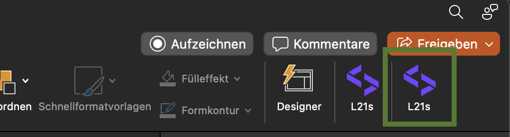

# L21s PowerPoint-AddIn

## Set up Locally

To start the AddIn locally, `Node.js` and `npm` must be installed.
An activated version of `PowerPoint` is also required.

To prepare the project for the first execution, the following two commands must be executed one after the other:

```zsh Terminal
npm install
```

```zsh Terminal
npm run build:dev
```

After the project has been successfully built, the following command starts the AddIn.

```zsh Terminal
npm run start:desktop
```

A new PowerPoint instance should be started at startup. After a few moments, the version of the AddIn can be seen in
this instance. This is reflected as follows. If an installation of the AddIn already exists, the icon on the right-hand
side is the locally started one.



While the code is being edited, the AddIn should be continuously updated (HotReload) so that the DevServer does not have
to be restarted. As soon as the local instance is no longer required, it can be terminated with the following
command:

```zsh Terminal
npm run stop
```

## Debugging
After running the following command, the developer console is available with right click into the add-in window and selecting element information.  
`defaults write com.microsoft.Powerpoint OfficeWebAddinDeveloperExtras -bool true`

⚠️ Mac App Store builds of Office do not support the OfficeWebAddinDeveloperExtras flag.

## API key encryption
If the Freepik API key or the API key secret is renewed, three steps must be executed:
1. Update the API key or the secret in 1Password.
2. Encrypt the API key by running `node encryptApiKey.ts` in the root directory of this repository.
3. Update the `const encryptedFreepikApiKey` in the `src/taskpane/encryptionUtils.ts` file with the encrypted API key.

## Helpful links

[PowerPoint Api-Documentation](https://learn.microsoft.com/de-de/javascript/api/powerpoint?view=powerpoint-js-preview)
[Office AddIn Scripts](https://github.com/OfficeDev/Office-Addin-Scripts)
[Office AddIn Samples](https://github.com/OfficeDev/Office-Add-in-samples)
